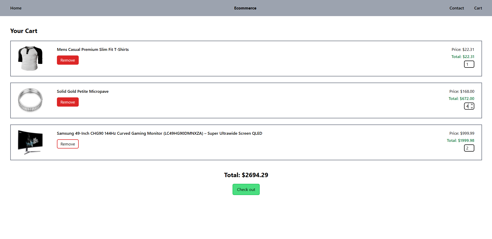

# Full-Stack E-Commerce Web App

This is a simple full-stack e-commerce website built with **React**, **Vite**, **MongoDB**, **Express**, **HTML**, and **TailwindCSS**. The site displays products from a MongoDB database, allows users to add items to a shopping cart, and provides a responsive UI with persistent cart data using local browser storage.

---

## Features

### Navigation Bar

Lets users move between:
- **Home**
- **Cart**
- **Contact**

---

### Home Page (Product List)

- Displays a list of products pulled from the MongoDB database through the backend API.  


---

### Add to Cart

- Add any product to the cart.
- Quantity controls (increase/decrease).
- Remove individual items.

---

### Cart Page

- View all added products.
- Increase/decrease quantity of each item.
- Remove items.
- View price per item × quantity.
- View total price for all items.
- Cart data is **saved in browser localStorage**, so it persists after page refresh or browser close.  


---

### Contact Page

- Displays email and phone number.  


---

## Tech Stack

### Front-End
- React with Vite
- TailwindCSS for styling
- React Router DOM for routing
- Axios for API calls
- localStorage for cart persistence

### Back-End
- Express.js for server and API routing
- MongoDB + Mongoose for database
- CORS for cross-origin requests
- Nodemon for backend development auto-reload

---

## Requirements

- [Node.js](https://nodejs.org/) and npm installed
- MongoDB running locally or in the cloud (e.g. [MongoDB Atlas](https://www.mongodb.com/atlas/database))

---

## Installation

### Clone the Repository

```bash
git clone https://github.com/AjayLokesh/ecommerce-app
cd ecommerce-app
```

### Back-End Setup
```bash
cd back-end
npm install
npm run dev
```
Make sure to update app.js to connect to your MongoDB URI.

### Front-End Setup
```bash
cd ../e-commerce
npm install
npm run dev
```
This will start the frontend on http://localhost:5173 (default Vite port).

# Data Persistence
The cart state is stored in the browser using localStorage, so even if the user closes or refreshes the page, their cart items will still be there when they return.
